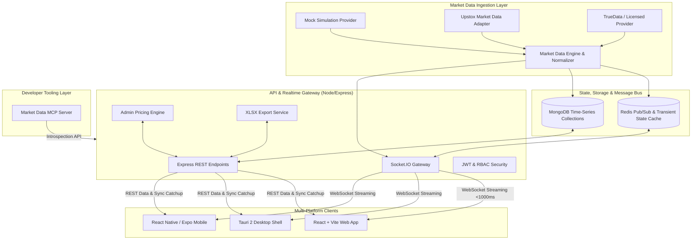

# System Architecture — MCX Commodity Live Market Platform

## 1. High-Level Architecture



---

## 2. Core Subsystems

### 2.1 Provider Abstraction Layer (`services/market-data`)
All upstream data feeds implement the standard `MarketDataProvider` interface:
```typescript
export interface MarketDataProvider {
  id: string;
  name: string;
  connect(): Promise<void>;
  disconnect(): Promise<void>;
  subscribe(instruments: InstrumentSubscription[]): Promise<void>;
  unsubscribe(instruments: InstrumentSubscription[]): Promise<void>;
  onTick(handler: (tick: CanonicalTick) => void): void;
  getSnapshot(instruments: InstrumentSubscription[]): Promise<MarketSnapshot[]>;
  getHistorical(req: HistoricalRequest): Promise<HistoricalCandle[]>;
  getHealth(): ProviderHealthStatus;
}
```

### 2.2 Canonical Tick Pipeline
Raw provider ticks (binary protobuf, JSON or simulated ticks) are converted into the immutable `CanonicalTick` structure with:
- Standardized commodity identifiers (`GOLD`, `SILVER`, `COPPER`, `CRUDE_OIL`, `NATURAL_GAS`).
- High-precision decimal prices (`ltp`, `bid`, `ask`, `open`, `high`, `low`, `close`).
- Millisecond timestamps (`sourceTimestamp`, `receivedTimestamp`).
- Monotonic sequence numbers for deduplication and client catchup.

### 2.3 Real-Time Distribution
- Socket.IO distributes ticks to segmented rooms (e.g. `commodity:GOLD`, `commodity:SILVER`, `market:all`).
- Average end-to-end latency is maintained strictly `< 1000ms`.
- Stale detection marks feeds if no ticks are received within the configured threshold (default: 5000ms).

### 2.4 Customer-Derived Pricing Engine
Raw exchange prices remain strictly isolated from business-specific taxation. The pricing engine computes:
$$\text{DisplayPrice} = \text{ExchangePrice} \times (1 + \text{CustomDutyRate}) \times (1 + \text{GSTRate}) + \text{OtherCharges}$$
Admin users can dynamically modify 15-day custom duty revisions and GST parameters with full audit logging and formula versioning.

### 2.5 Offline Reconciliation Protocol
Clients maintain local caches in IndexedDB (Web) or SQLite (Mobile/Desktop). When recovering from network outages, the client queries `/api/commodities/:commodity/sync?sinceSequence=X&sinceTimestamp=Y` to backfill missing candles and obtain an authoritative snapshot before transitioning UI state to `LIVE`.
