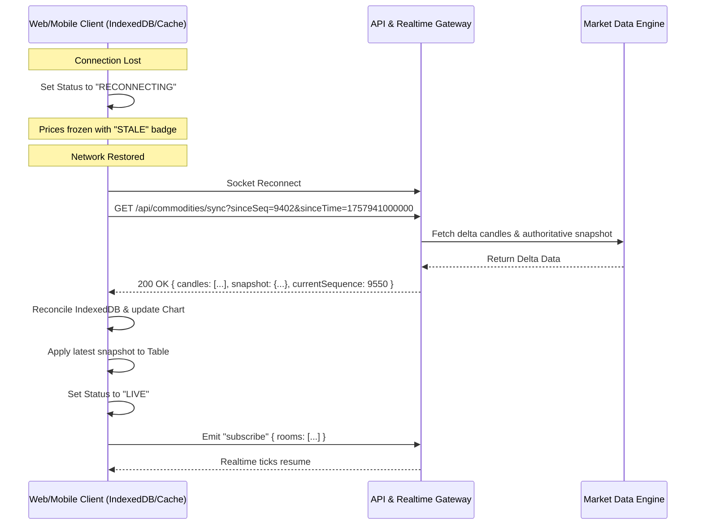

# Offline Caching & Synchronization Protocol

## 1. Problem Statement

In volatile commodity trading environments, network drops (WiFi handoffs, mobile cell towers, elevator transitions) are frequent. When a user regains connectivity:
1. They must not see stale prices masquerading as live.
2. The UI must not perform an expensive full page reload.
3. The server must not overwhelm the client by replaying millions of raw ticks.
4. The client must automatically backfill missing interval candles and smoothly transition back to `LIVE`.

---

## 2. Sync Lifecycle

---

## 3. Implementation Details

### 3.1 Client Storage
- **Web**: HTML5 `IndexedDB` stores the last 24 hours of 1-minute and 5-minute candles and the last received snapshot metadata.
- **Mobile/Desktop**: Persistent SQLite/KV storage stores historical data across application restarts.

### 3.2 Sequence Numbers
Every tick generated or received by the `MarketDataEngine` is assigned a monotonically increasing sequence ID:
$$\text{sequence} = N + 1$$
If a client observes a gap in sequence numbers ($S_{\text{received}} > S_{\text{expected}} + 1$), it triggers a silent background sync request to ensure candle continuity.
